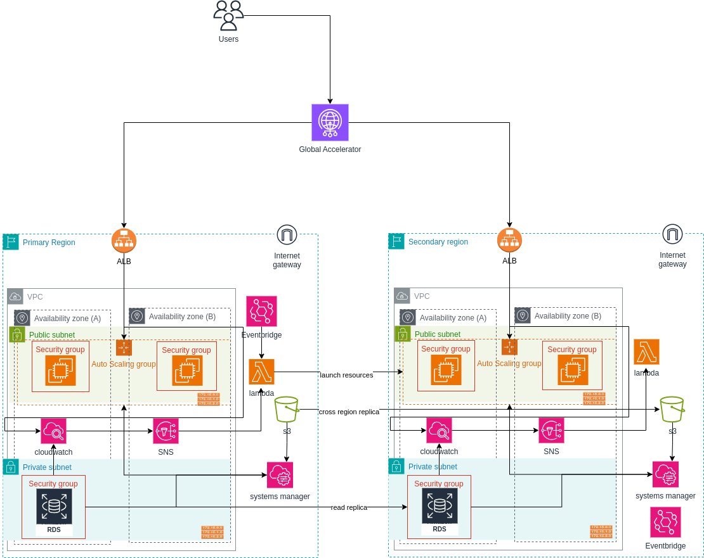

# Nebula - AWS Pilot Light Disaster Recovery Solution

## Overview
This repository contains the infrastructure-as-code implementation of a disaster recovery (DR) solution using the Pilot Light strategy on AWS. The solution ensures high availability of critical services (EC2, RDS, S3) with minimal overhead and quick recovery capabilities.

## Architecture


The solution implements a pilot light disaster recovery strategy across two AWS regions:
- **Primary Region**: Hosts the main production environment
- **DR Region**: Maintains minimal infrastructure that can be quickly scaled up during failover

### Core Components

#### 1. EC2 (Elastic Compute Cloud)
- Maintains stopped EC2 instances in DR region
- Uses Auto Scaling Groups for quick instance provisioning
- Regular AMI updates for consistent instance states

#### 2. RDS (Relational Database Service)
- Cross-region read replicas for database redundancy
- Automated backups and manual snapshots
- Quick promotion capability for read replicas

#### 3. S3 (Simple Storage Service)
- Cross-Region Replication (CRR) enabled
- Versioning enabled for data protection
- Lifecycle policies for cost optimization


## Project Structure
```
├── docs/                    # Documentation files
├── global_accelerator_/  
└── modules/                # Terraform modules
    ├── alb/                # Application Load Balancer configuration
    ├── ec2/                # EC2 instance configuration
    ├── lambda/             # Lambda functions configuration
    ├── rds/                # RDS configuration
    ├── failover/           # Failover processes
    ├── iam/                # IAM configurations
    ├── ssm/                # SSM parameter store configs
    └── s3/                 # S3 bucket configuration
```

## Prerequisites
- Terraform >= 1.0
- AWS CLI configured with appropriate credentials
- Access to two AWS regions
- Appropriate IAM permissions

## Deployment
1. Configure variables in `terraform.tfvars`
2. Deploy:
   ```bash
   terraform init
   terraform plan
   terraform apply
   ```

## Disaster Recovery Process
1. **Monitoring**: CloudWatch alarms monitor critical metrics
2. **Failover Trigger**: Automated or manual failover initiation
3. **Scale Up**: DR region resources are scaled up
4. **DNS Cutover**: Route 53 updates for traffic redirection
5. **Validation**: System health verification

Detailed runbook available in [docs/recovery_strategy.md](docs/recovery_strategy.md)

## Maintenance
- Regular testing of failover procedures
- AMI updates and patch management
- Backup verification
- DR documentation updates

## Cost Optimization
- Minimal resource usage in DR region
- Automated resource scaling
- Lifecycle policies for S3 data
- Cost monitoring and optimization recommendations

## Monitoring and Alerts
- CloudWatch dashboards for system health
- SNS notifications for critical events
- Regular replication lag monitoring
- Automated failover triggers

## Contributing
1. Fork the repository
2. Create a feature branch
3. Submit a pull request